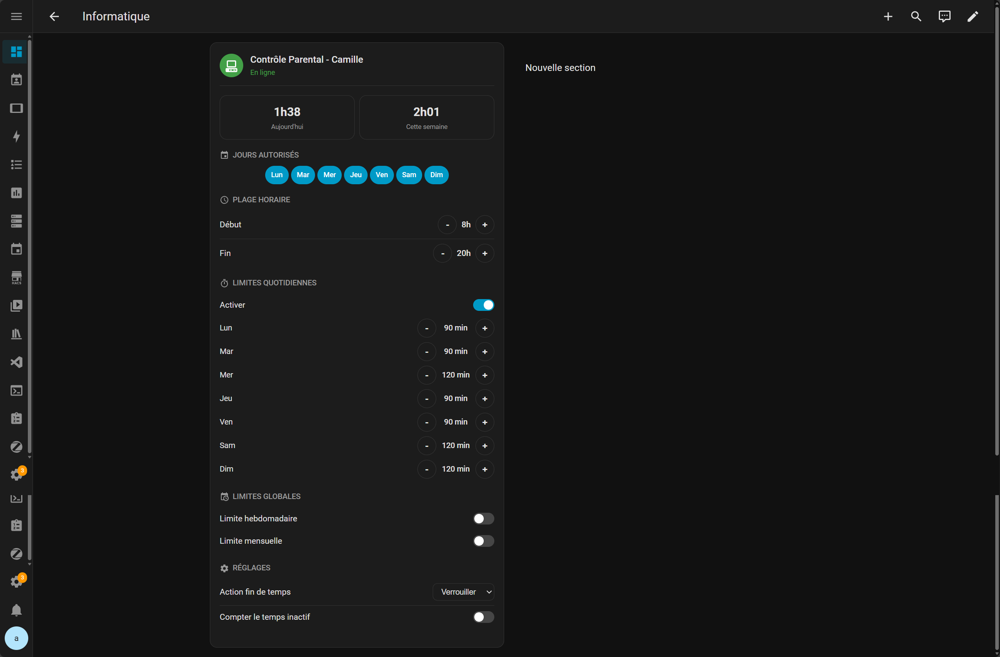

# Timekpra - Contrôle Parental pour Home Assistant

Intégration Home Assistant pour gérer [Timekpr-nExT](https://mjasnik.gitlab.io/timekpr-next/) (contrôle parental Linux) à distance via SSH.

Contrôlez le temps d'écran de vos enfants directement depuis votre dashboard Home Assistant, même quand leur ordinateur est éteint.

## Fonctionnalités

- **Limites quotidiennes** : réglables par jour (Lun-Dim), avec boutons +/- directement dans la carte
- **Limite hebdomadaire / mensuelle** : en heures, avec affichage "Illimité" quand désactivé
- **Plage horaire** : heure de début et fin d'accès autorisé
- **Jours autorisés** : toggle par jour de la semaine
- **Type de verrouillage** : lock / suspend / shutdown (menu déroulant)
- **Suivi du temps inactif** : on/off
- **Capteurs** : temps utilisé aujourd'hui et cette semaine
- **Statut** : ordinateur en ligne / hors ligne
- **File d'attente offline** : les modifications sont mises en attente si l'ordinateur est éteint et appliquées automatiquement au rallumage (persistant entre redémarrages HA)
- **Carte Lovelace intégrée** : carte personnalisée installée automatiquement avec contrôles interactifs

## Installation

### Via HACS (recommandé)

1. Ouvrir HACS dans Home Assistant
2. Cliquer sur **Intégrations** > **⋮** (menu) > **Dépôts personnalisés**
3. Ajouter l'URL du dépôt : `https://github.com/tienou/ha-timekpra`
4. Catégorie : **Intégration**
5. Installer **Timekpra - Contrôle Parental**
6. Redémarrer Home Assistant

### Manuelle

Copier le dossier `custom_components/timekpra/` dans le répertoire `config/custom_components/` de votre Home Assistant, puis redémarrer.

## Configuration

### Prérequis sur la machine de l'enfant (Ubuntu / Linux)

- **Timekpr-nExT** installé (`sudo apt install timekpr-next`)
- **SSH** activé (`sudo apt install openssh-server`)
- Un compte utilisateur avec accès **sudo** (ex: `parents`)

> **Astuce** : Le mot de passe SSH est utilisé automatiquement pour les commandes `sudo`. Pas besoin de configuration sudoers spéciale.

### Ajout dans Home Assistant

1. **Paramètres** > **Appareils et services** > **Ajouter une intégration**
2. Chercher **Timekpra**
3. Remplir :
   - **Hôte SSH** : IP de la machine de l'enfant (ex: `192.168.1.50`)
   - **Port SSH** : `22` (par défaut)
   - **Utilisateur SSH** : compte avec accès sudo (ex: `parents`)
   - **Mot de passe SSH** : mot de passe du compte
   - **Utilisateur Timekpra** : le login de l'enfant (ex: `camille`)

### Modifier la configuration

Pour changer les identifiants SSH après l'installation :
**Paramètres** > **Appareils et services** > **Timekpra** > **Configurer**

## Carte Lovelace

La carte est installée automatiquement. Pour l'ajouter à un dashboard :

1. Dashboard > **Modifier** > **Ajouter une carte**
2. Chercher **Timekpra** dans la liste des cartes
3. La carte affiche tous les contrôles avec des boutons **+/-** pour modifier les valeurs directement

### Fonctionnalités de la carte

- **Limites quotidiennes** : boutons ±15 min par jour, affiche "Illimité" à 1440 min
- **Limite hebdomadaire** : boutons ±1h, affiche "Illimité" à 168h
- **Limite mensuelle** : boutons ±1h, affiche "Illimité" à 744h
- **Plage horaire** : boutons ±1h pour début et fin
- **Jours autorisés** : toggles on/off
- **Type de verrouillage** : menu déroulant (lock/suspend/shutdown)
- **Statut en temps réel** : en ligne/hors ligne + commandes en attente

## Entités créées

| Type | Entités |
|------|---------|
| **Number** | Limite Lundi…Dimanche, Limite hebdo, Limite mensuelle, Heure début/fin |
| **Switch** | Jour autorisé Lundi…Dimanche, Compter le temps inactif, Limite hebdo on/off, Limite mensuelle on/off |
| **Select** | Action fin de temps (lock/suspend/shutdown) |
| **Sensor** | Temps utilisé aujourd'hui, Temps utilisé cette semaine, Ordinateur (en ligne/hors ligne), Modifications en attente |

## Fonctionnement technique

- Connexion SSH via `asyncssh` avec authentification par mot de passe
- Lecture de la config depuis `/var/lib/timekpr/config/timekpr.{user}.conf`
- Écriture via la CLI `timekpra` (ex: `timekpra --settimelimits`)
- Rafraîchissement toutes les 5 minutes (configurable)
- File d'attente persistante pour les commandes quand la machine cible est hors ligne

## Licence

MIT
